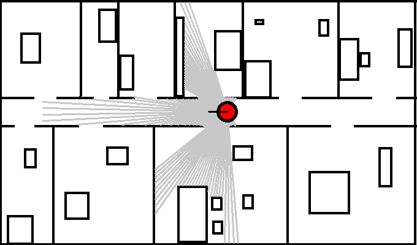
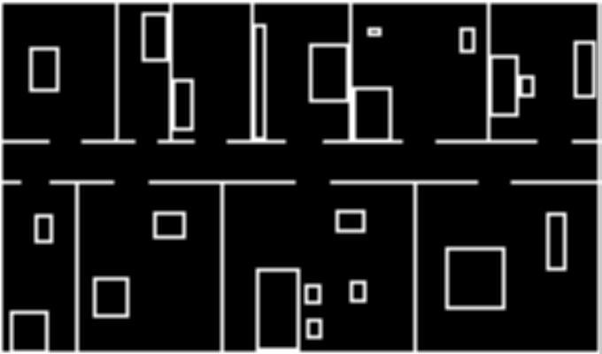
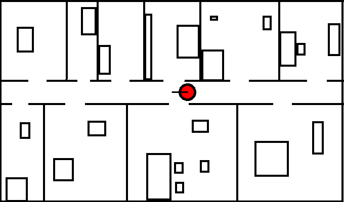

# intialization 
-   Robot pose (370, 182, 180)
-   Robot radius 15
# Problem 1
This is the output for problem 1

- [output text file](Problem1_output.txt)
# Problem 2
This is the output for problem 2
- likelihood filed

- prob_map

- output

# Requirments
- you need to install `python 3.8.5`
- you need to install `numpy`
- you need to install `cv2`
  
# Run instructions
Run this command in terminal in the project dirctory `python3 maiin.py`.